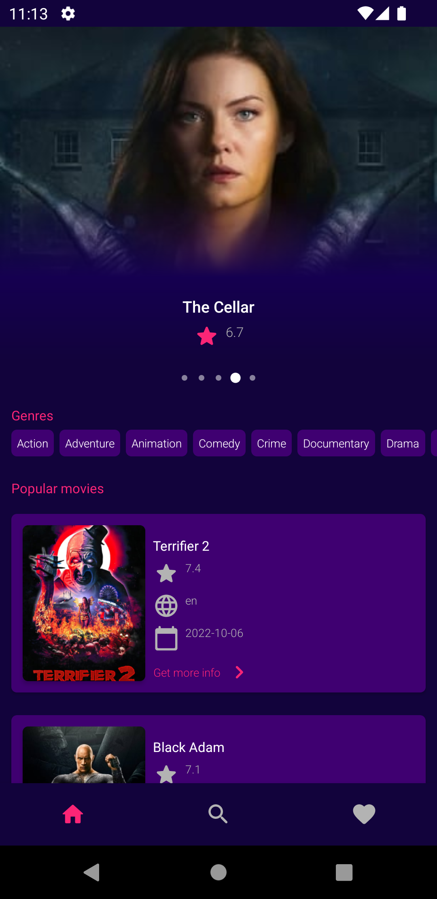
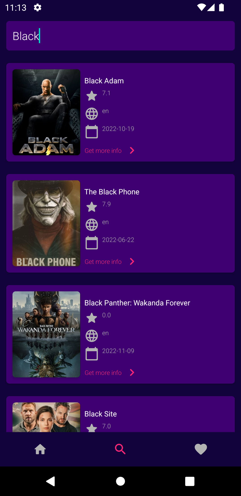
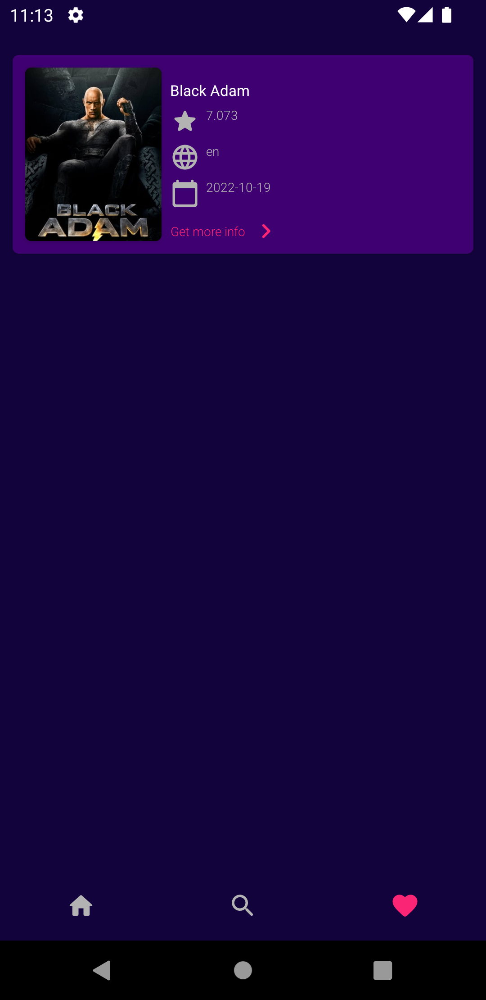
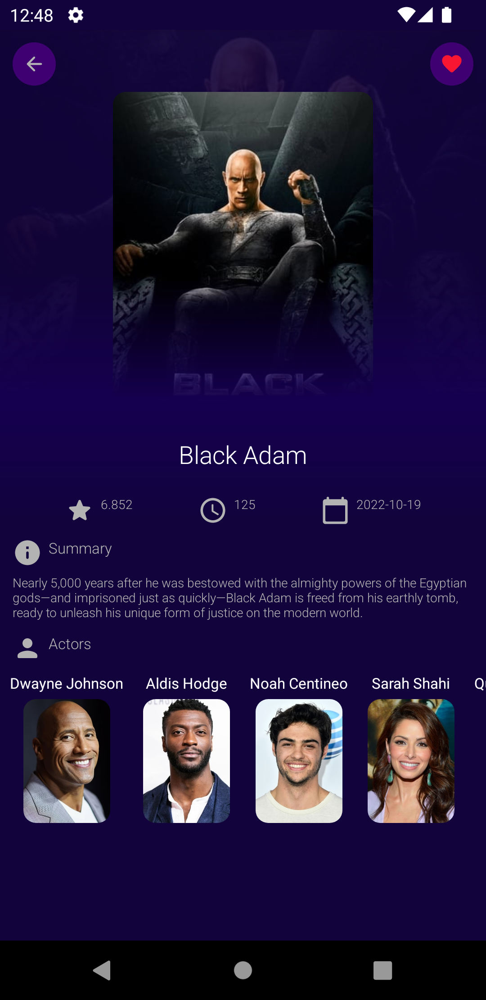

# Themoviedb-API

Overview :

The purpose of this application is to provide a list of Movies and show the details of each Movie :

The app was written in Kotlin.

The API’s Docs: https://developers.themoviedb.org/3/getting-started
 
 
Technologies and Libraries Used :
* Navigation Component
* View Binding
* Retrofit
* Dagger Hilt
* Coroutines
* Live Data
* Coil

Screen-Shot :
 

