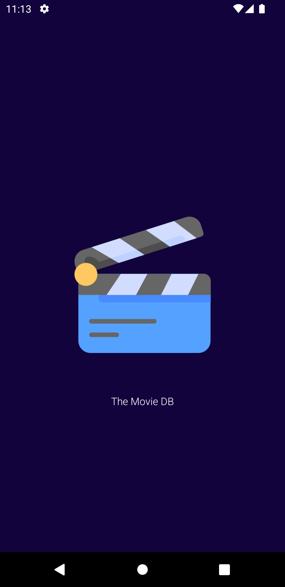
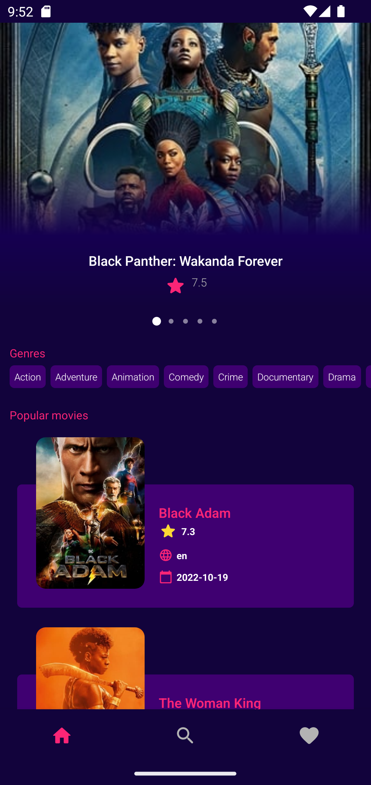
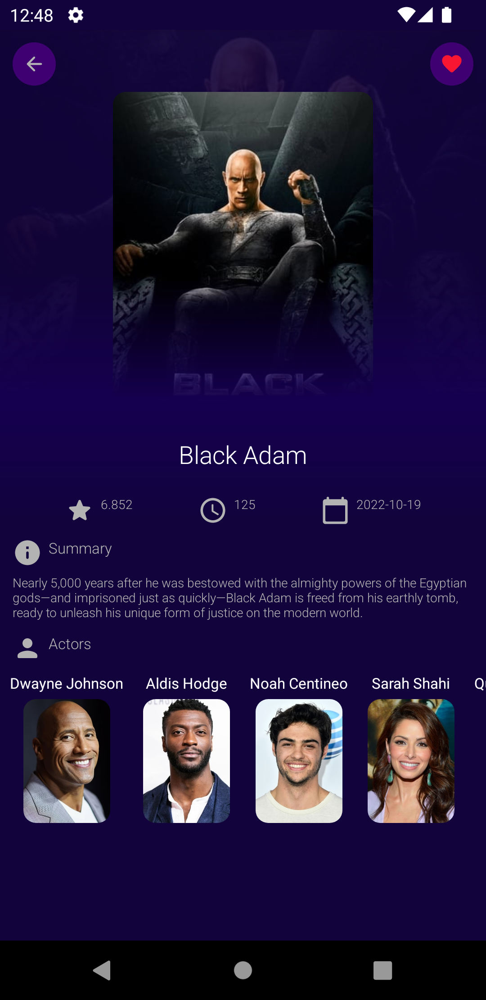
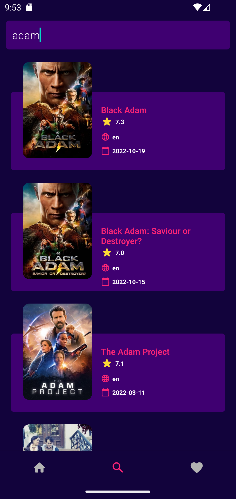
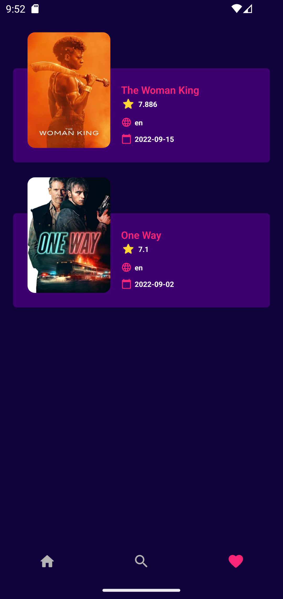

# Themoviedb-API-MVVM

Overview :

The purpose of this project series is to show different architectures with different structures, and you can check these architectures and structures.

This project in
- MVP architecture : https://github.com/ezatpanah/Themoviedb-API-MVP  [ Room Database - Dagger Hilt - RxJava ]
- MVVM architecture :  Current Repo 
- MVI architecture : Coming soon

The app was written in Kotlin.

The API’s Docs: https://developers.themoviedb.org/3/getting-started
 
 
Technologies and Libraries Used :
* Navigation Component
* View Binding
* Retrofit
* Dagger Hilt
* Coroutines
* Live Data
* Coil

Screen-Shot :
 

